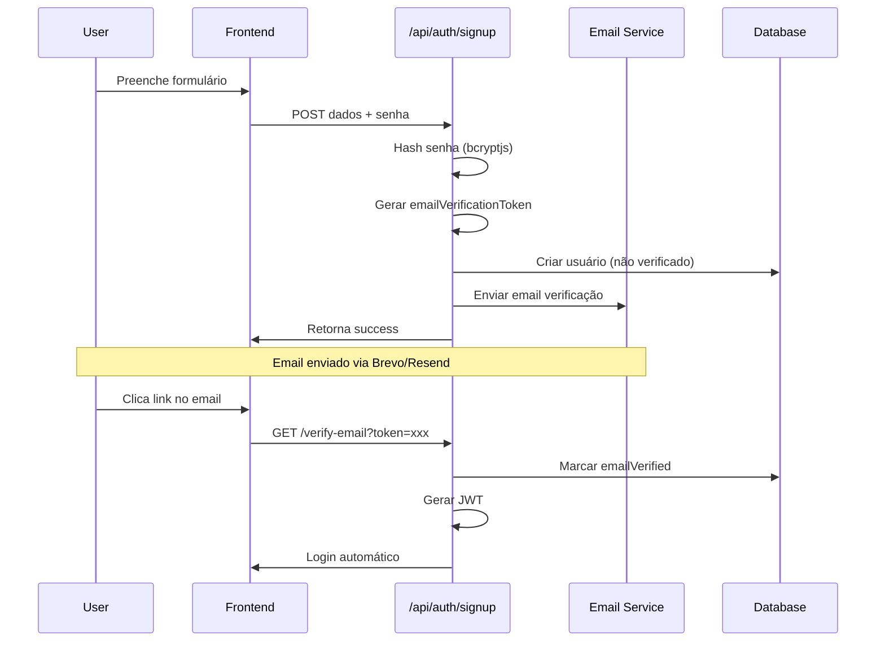
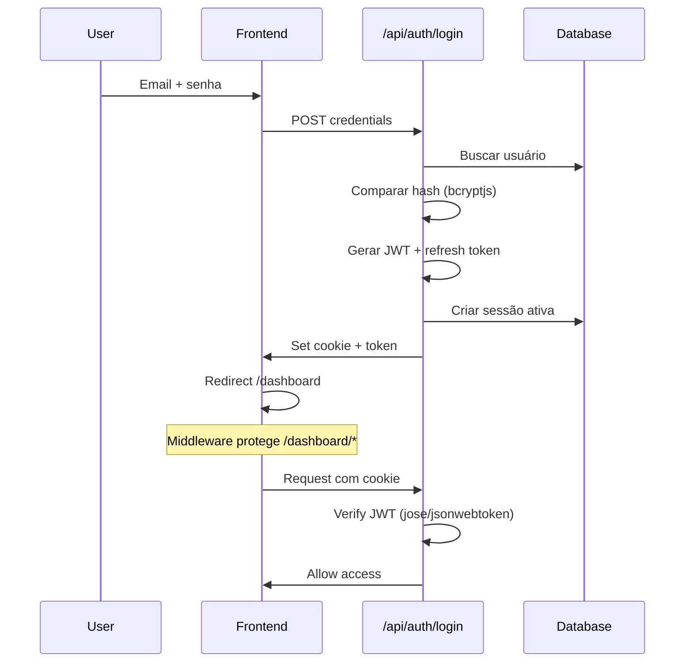
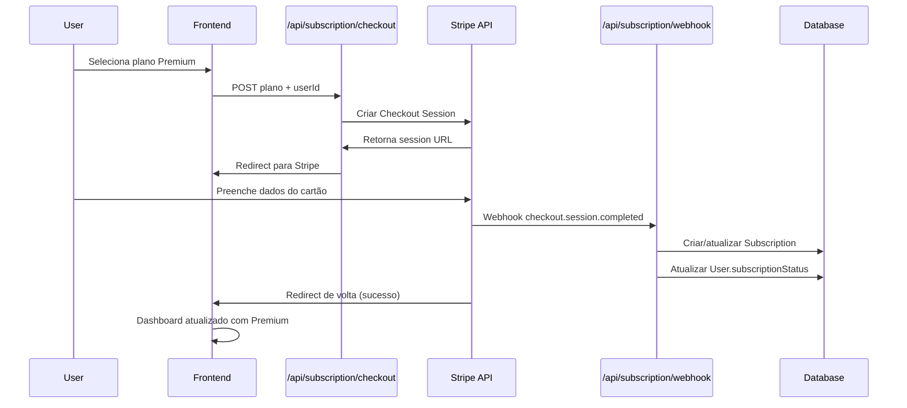
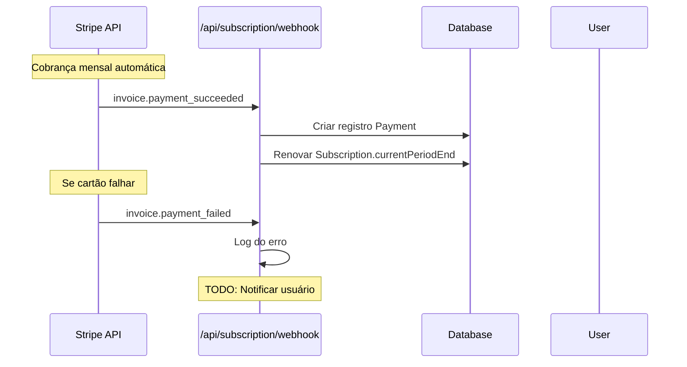

# ARCHITECTURE.md - Arquitetura do Sistema

## Estrutura de Pastas Completa

```
src/
├── app/                    # App Router (Next.js 13+)
│   ├── api/                # API Routes (46 endpoints)
│   │   ├── admin/          # Admin endpoints (5)
│   │   ├── ai/             # OpenAI integrations (3)
│   │   ├── auth/           # Authentication (7)
│   │   ├── categories/     # Category management (1)
│   │   ├── dashboard/      # Dashboard stats (1)
│   │   ├── goals/          # Financial goals CRUD (3)
│   │   ├── internal/       # Internal services (1)
│   │   ├── investments/    # Investment CRUD (3)
│   │   ├── subscription/   # Stripe integration (3)
│   │   ├── telegram/       # Telegram bot (4)
│   │   ├── transactions/   # Transaction CRUD (4)
│   │   ├── user/           # User management (6)
│   │   └── whatsapp/       # WhatsApp bot (4)
│   ├── auth/               # Authentication pages
│   ├── dashboard/          # Protected dashboard pages
│   └── page.tsx           # Landing page
├── components/
│   └── ui/                 # Reusable UI components
├── contexts/               # React contexts
├── lib/                    # Utility libraries
├── types/                  # TypeScript type definitions
└── middleware.ts           # Edge middleware (auth + security)

prisma/
└── schema.prisma           # Database schema

scripts/                    # Utility scripts (26 files)
├── check-*.ts             # Database verification
├── create-*.ts            # Data creation
├── delete-*.ts            # Data cleanup
└── test-*.ts              # Integration tests
```

---

## Fluxo de Dados: Mensagem → Banco de Dados

### 1. Bot Telegram - Fluxo Completo
```mermaid
graph TD
    A[Usuário envia mensagem] --> B[Telegram API]
    B --> C[Webhook /api/telegram/webhook]
    C --> D[Verificar usuário vinculado]
    D --> E{Usuário existe?}
    E -->|Não| F[Enviar instruções de vinculação]
    E -->|Sim| G[Parse da mensagem]
    G --> H{Tipo de mensagem?}
    H -->|Receita| I[parseIncomeMessage()]
    H -->|Gasto| J[parseExpenseMessage()]
    H -->|Consulta| K[parseQueryMessage()]
    I --> L[Criar transação INCOME]
    J --> M[Criar transação EXPENSE]
    K --> N[Gerar resposta com dados]
    L --> O[Buscar/criar categoria]
    M --> O
    O --> P[Salvar no PostgreSQL via Prisma]
    P --> Q[Calcular estatísticas]
    Q --> R[Enviar confirmação via Telegram API]
    N --> R
```

### 2. Bot WhatsApp - Fluxo Completo
```mermaid
graph TD
    A[Usuário envia mensagem] --> B[EditaCódigo API]
    B --> C[Webhook /api/whatsapp/webhook]
    C --> D[Extrair número do telefone]
    D --> E[Buscar usuário por whatsappId]
    E --> F{Usuário vinculado?}
    F -->|Não| G[Enviar instruções via sendWhatsAppMessage()]
    F -->|Sim| H[Reutilizar parsers do Telegram]
    H --> I[Mesmo fluxo de processamento]
    I --> J[Salvar no banco]
    J --> K[Responder via EditaCódigo API]
```

---

## Fluxo de Autenticação

### 1. Registro de Usuário


### 2. Login e Sessão


---

## Fluxo de Pagamento (Stripe)

### 1. Checkout de Assinatura


### 2. Eventos de Cobrança Recorrente


---

## Schema do Prisma Explicado

### Entidades Core
```sql
-- Usuários principais do sistema
User {
  id: cuid() -- Primary key
  email: string (unique) -- Login
  telegramId: string? (unique) -- Vinculação Telegram
  whatsappId: string? (unique) -- Vinculação WhatsApp

  -- Sistema de planos
  subscriptionStatus: "TRIAL" | "ACTIVE" | "EXPIRED" | "CANCELLED"
  subscriptionPlan: "FREE" | "BASIC" | "PREMIUM"
  trialEndsAt: DateTime? -- 7 dias de trial

  -- Relacionamentos
  transactions: Transaction[]
  goals: Goal[]
  investments: Investment[]
  subscription: Subscription?
}

-- Transações financeiras (core do sistema)
Transaction {
  id: cuid()
  amount: Float -- Valor sempre positivo
  type: "INCOME" | "EXPENSE" -- Diferencia receita/gasto
  description: string -- "Uber", "Salário", etc.
  method: "CASH" | "CREDIT_CARD" | "PIX" | "OTHER"

  -- Relacionamentos
  userId: string -> User.id
  categoryId: string -> Category.id

  -- Índices otimizados
  @@unique([userId, amount, description, type, date]) -- Evita duplicatas
  @@index([userId, createdAt]) -- Queries rápidas por usuário/data
}

-- Categorias dinâmicas (criadas automaticamente)
Category {
  id: cuid()
  name: string (unique) -- "Transporte", "Refeição", "Moradia"
  icon: string? -- Para UI futura
  color: string? -- Para UI futura

  transactions: Transaction[]
}

-- Sistema de assinaturas Stripe
Subscription {
  id: cuid()
  userId: string (unique) -> User.id
  status: "TRIAL" | "ACTIVE" | "EXPIRED" | "CANCELLED"
  plan: "FREE" | "BASIC" | "PREMIUM"

  -- Controle de período
  currentPeriodStart: DateTime?
  currentPeriodEnd: DateTime?
  cancelAtPeriodEnd: boolean

  -- Integração Stripe
  gatewaySubscriptionId: string? (unique) -- ID do Stripe
  gateway: "STRIPE"

  payments: Payment[]
}
```

### Relacionamentos
```
User 1:N Transaction (um usuário, muitas transações)
User 1:N Goal (um usuário, muitas metas)
User 1:N Investment (um usuário, muitos investimentos)
User 1:1 Subscription (um usuário, uma assinatura)
User 1:1 UserSettings (um usuário, uma configuração)
User 1:1 TelegramAlertSettings (configurações de alerta)

Category 1:N Transaction (uma categoria, muitas transações)
Subscription 1:N Payment (uma assinatura, muitos pagamentos)
```

---

## APIs e Componentes React

### Principais APIs por Funcionalidade

#### Autenticação (`/api/auth/*`)
- `POST /signup` - Registro de usuário
- `POST /login` - Login com email/senha
- `POST /logout` - Logout + invalidar sessão
- `POST /forgot-password` - Solicitar reset de senha
- `POST /reset-password` - Confirmar nova senha
- `GET /verify-email` - Verificar email via token
- `POST /resend-verification` - Reenviar email de verificação

#### Transações (`/api/transactions/*`)
- `GET /api/transactions` - Listar transações do usuário
- `POST /api/transactions` - Criar nova transação
- `PUT /api/transactions/[id]` - Editar transação
- `DELETE /api/transactions/[id]` - Deletar transação
- `GET /api/transactions/export` - Exportar dados (PDF/CSV)

#### IA Premium (`/api/ai/*`)
- `POST /api/ai/insights` - Gerar análise financeira (Premium)
- `POST /api/ai/reports` - Relatórios personalizados (Premium)
- `GET /api/ai/tips` - Dicas de economia (Premium)

### Componentes React Principais

#### Dashboard (`src/app/dashboard/page.tsx`)
```typescript
// Métricas em tempo real
- FinancialMetrics: Saldo, receitas, gastos
- TransactionChart: Gráfico mensal (Recharts)
- CategoryBreakdown: Top categorias
- GoalProgress: Progresso das metas
- QuickActions: Botões rápidos
```

#### Gestão de Transações (`src/app/dashboard/transactions/page.tsx`)
```typescript
// CRUD completo
- TransactionForm: Criar/editar transação
- TransactionList: Tabela paginada
- CategorySelector: Dropdown de categorias
- TransactionFilters: Filtros por data/categoria/tipo
- ExportButton: Download CSV/PDF
```

#### Sistema de Pagamentos (`src/app/dashboard/subscription/page.tsx`)
```typescript
// Integração Stripe
- PlanCards: Exibir planos Free/Basic/Premium
- SubscriptionStatus: Status atual do usuário
- StripeCheckout: Botão para upgrade
- PaymentHistory: Histórico de pagamentos
```

---

## Comunicação Bots ↔ Backend

### Telegram Bot
```typescript
// src/app/api/telegram/webhook/route.ts
1. Recebe update do Telegram
2. Extrai: chatId, userId, message.text
3. Verificar se usuário está vinculado (telegramId)
4. Parse da mensagem:
   - parseIncomeMessage() - "recebi 1200 salário"
   - parseExpenseMessage() - "50 uber", "gastei 100 gasolina"
   - parseQueryMessage() - "qual meu saldo?"
5. CRUD no banco via Prisma
6. Resposta via sendMessage() → Telegram API
```

### WhatsApp Bot
```typescript
// src/app/api/whatsapp/webhook/route.ts
1. Recebe webhook da EditaCódigo API
2. Extrai: phoneNumber, messageBody
3. Verificar se usuário está vinculado (whatsappId)
4. Reutilizar parsers do Telegram (mesma lógica)
5. CRUD no banco via Prisma
6. Resposta via sendWhatsAppMessage() → EditaCódigo API
```

### Parser de Linguagem Natural
```typescript
// Implementação inteligente com regex + OpenAI
parseExpenseMessage("50 uber") → {
  amount: 50,
  description: "uber",
  category: "Transporte" // Via categorizeExpense()
}

parseIncomeMessage("recebi 1200 salário") → {
  amount: 1200,
  description: "salário",
  category: "Salário" // Via categorizeIncome()
}

// Categorização automática por palavras-chave + IA
categorizeExpense("uber") → "Transporte"
categorizeExpense("supermercado") → "Refeição"
// Se não encontrar, usa OpenAI (Premium)
```

---

## Middleware de Segurança

### Edge Middleware (`src/middleware.ts`)
```typescript
// Executa em todas as requests
1. Proteção de rotas /dashboard/*
2. Verificação JWT (edge-compatible)
3. Headers de segurança:
   - Content-Security-Policy
   - X-Frame-Options: DENY
   - X-Content-Type-Options: nosniff
   - HSTS (produção)
4. Redirect para /auth/login se não autenticado
```

### Subscription Middleware
```typescript
// src/lib/subscription-middleware.ts
requirePremiumAccess(userId) {
  // Verificar se usuário tem plano Premium ativo
  // Usado em /api/ai/* endpoints
  // Bloqueia acesso se não for Premium
}
```

---

## Performance e Escalabilidade

### Database Otimizações
```sql
-- Índices estratégicos
@@index([userId, createdAt], name: "user_transactions_by_date")
@@unique([userId, amount, description, type, date], name: "unique_transaction")

-- Queries otimizadas
- Transações por usuário + data: index scan
- Prevenção duplicatas: unique constraint
- Agregações (somas): index range scan
```

### API Performance
```typescript
// Prisma optimizations
- Connection pooling (Neon)
- Selective field loading: select: { name: true }
- Batch operations where possible
- Transaction.take(500) - limite razoável

// Edge optimizations
- JWT verification na edge (sem DB calls)
- Middleware cache para static assets
- CSP headers pré-computados
```

### Vercel Function Limits
```typescript
// Current limits
- Max execution: 30s per API call
- Memory: 1024MB default
- Concurrent executions: auto-scaling
- Cold starts: ~100-300ms typical
```